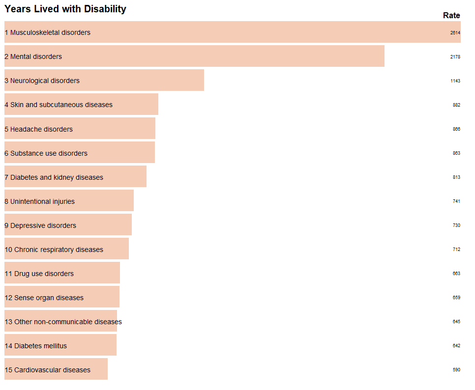
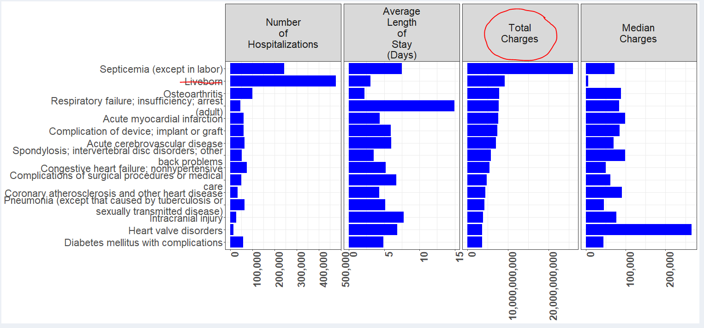
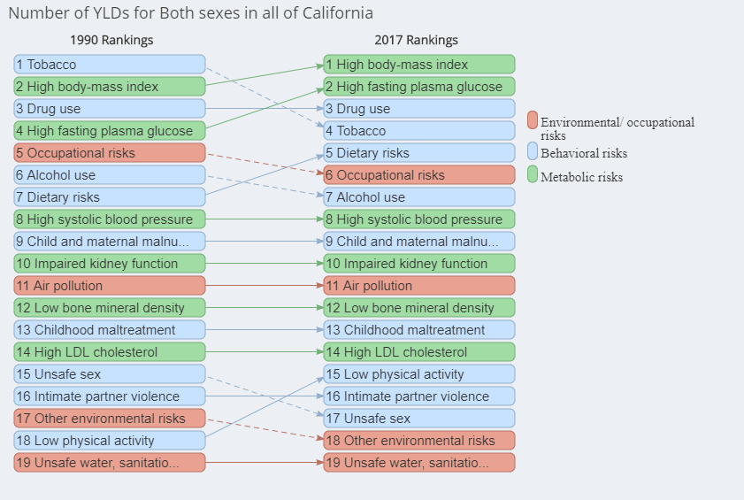
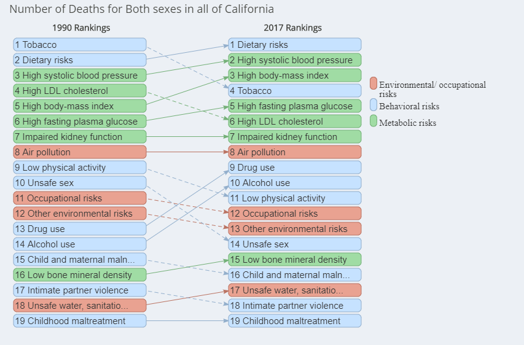
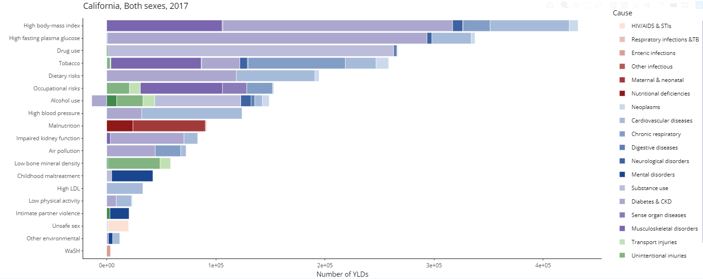

```{r setup, include=FALSE}

# rmarkdown::render("f:/0.CBD/myAnalyses/0.StateOfHealth/StateOfHealth.Rmd")

 knitr::opts_chunk$set(echo = FALSE, warnings = FALSE, message = FALSE, include=TRUE, fig.width=14, fig.height=8)  
 options(warn = -1)  # https://github.com/rstudio/blogdown/issues/90

library(dplyr)         # data wrangling powerhouse
library(readr)         # read .csv and other files
library(readxl)        # read excel files
library(fs)            # for "path" function
library(knitr)
library(stringr)
library(cowplot) 
 
topSlice <- 15 
topFive  <- 5
mainYear <- 2018

myTitleSize <- 24
myLegendSize <- 24
myAxisSize  <- 22


myTextSize2 <- 12
myTextSize3 <- 20

myWrapNumber <- 70
myTitleColor <- "darkblue"

myCex1           <- 2  # 1.5  #line labels
myCex2           <- 1.2  #currently used only in education trend
myLineLabelSpace <- 0.3

myLineSize  <- 2
myPointSize <- 5 # line markers
myPointShape <- 18

theme_update(
               plot.title   = element_text(size = myTitleSize, color="blue"),
      
               strip.text.y = element_text(size = myTextSize2, face="bold", angle = 0),
               strip.text.x = element_text(size = myTextSize2, face="bold", angle = 0),
               
               axis.title   = element_text(size = myTextSize2, face="bold"),
               
               axis.text.y  = element_text(size = myTextSize2), 
               axis.text.x  = element_text(size = myTextSize2),
              #axis.text.x  = element_text(size = 10,          face="bold", angle = 40, hjust = 1),

               
               
             )

```


```{r}

t.dat.00 <- datCounty  %>% filter(county=="CALIFORNIA",
                               sex=="Total") %>%
                        mutate(t.cause = str_sub(CAUSE,1,1),
                               topLev = ifelse(t.cause== "A","Communicable",
                                        ifelse(t.cause== "B","Cancer",
                                        ifelse(t.cause== "C","Cardiovascular", 
                                        ifelse(t.cause== "D","Other Chronic",  
                                        ifelse(t.cause== "E","Injury","JUNK"
                                               )))))
                               )     %>%
                        left_join(fullCauseList,by=c("CAUSE" = "LABEL")) %>%
                        mutate(Cause=shortName)

topLevColors        <- brewer.pal(n = 6, name = "Dark2")
names(topLevColors) <- unique(t.dat.00$topLev)  

t.dat.0 <- t.dat.00   %>% filter(year==2018)  
```


```{r}
# datCountyRACE_AGE  <- readRDS(path(myPlace,"/myData/",whichData,"datCounty_RACE_AGE_TEMP.RDS"))  
# 
# 
# 
# datR00 <- datCountyRACE_AGE %>% 
#               filter(CAUSE == "0",county == "California", yearG3 == "2016-2018",!is.na(sex), sex != "Total") %>%
#         mutate(ageG = ifelse(ageG == "5 - 14"," 5 - 14",ageG),
#                ageG = ifelse(ageG == "0 - 4"," 0 - 4",ageG),
#                ageG = ifelse(ageG == "85 - 999","85+",ageG),) %>%
#               filter(!raceCode %in% c("Other-NH","-missing","Unk-NH","Multi-NH","AIAN-NH")) %>%
#               mutate(rate = 100000*Ndeaths/pop)


# datRA0 <-  datCountyRACE_AGE %>% 
#               mutate(ageBIG = ifelse(ageG %in% c("75 - 84","85 - 999"),">=75","<75"),
#                      junk = nchar(CAUSE)) %>%
#               filter((junk == 3 | CAUSE == "0"),county == "California", yearG3 == "2016-2018", sex == "Total") %>%
#               group_by(county, CAUSE, raceCode, ageBIG) %>%
#               summarise(Ndeaths = sum(Ndeaths),
#                         pop = sum(pop) )  %>% ungroup %>%
#               mutate(rate = 100000*Ndeaths/pop) %>%
#               mutate(t.cause = str_sub(CAUSE,1,1),
#                                topLev = ifelse(t.cause== "A","Communicable",
#                                         ifelse(t.cause== "B","Cancer",
#                                         ifelse(t.cause== "C","Cardiovascular", 
#                                         ifelse(t.cause== "D","Other Chronic",  
#                                         ifelse(t.cause== "E","Injury","JUNK"
#                                                )))))
#                                )     %>%
#                         left_join(fullCauseList,by=c("CAUSE" = "LABEL")) %>%
#               select(-t.cause,-causeList,-CAUSE,-pop,-topLev) %>% rename(Cause = nameOnly) %>%
#               arrange(ageBIG,raceCode) %>%  # THIS determines the ordering of the columns in pivot wider!
#               filter(!(raceCode %in% c("Other-NH","-missing","Unk-NH","Multi-NH")))
# 
# datRA1 <- pivot_wider(datRA0, names_from = c("ageBIG","raceCode"), values_from = c("rate","Ndeaths"))
# 
# write_csv(datRA1,"raceAGeExplore.csv")

```


## The **overall** health of Californian's is great, and is getting better!


source(XXXX)


## Health California
```{r, out.width = "100%"}
# Bigger fig.width

```


## Key Links 

<style>

div.blue { background-color:#e6f0ff; border-radius: 5px; padding: 20px;}
</style>
<div class = "blue">

[Let's Get Healthy California](https://letsgethealthy.ca.gov/)

[Public CCB](https://skylab.cdph.ca.gov/communityBurden/)

[CDPH CCB](https://discovery.dev.cdph.ca.gov/fusion/0.CBD/myCBD/)

[Age-by-Cause and Race-by-Cause CDPH Shiny](https://skylab.dev.cdph.ca.gov/content/33/)

[CA Demographic Shiny](https://skylab.dev.cdph.ca.gov/content/34/)


</div>


## **BIG PATTERNS AND TRENDS**

The following slides show a very "high altitude" view of burden of disease in California in 2018, based on the most aggregated level of diseases/conditions, ranked by numbers of deaths and premature deaths (years of life lost before age 75).  We can add similar rankings by disparities and/or sharpest increases over time, pending discussion


## X1 "Largest Broadest Grouping Categories" Ranking of Number of Deaths in `r mainYear`
```{r}

t.dat <- t.dat.0   %>% filter(Level=="lev1")  %>%
                        mutate(nameOnly = ifelse(CAUSE %in% c("B","C","D"),"Chronic",nameOnly)) %>% 
                        filter(CAUSE != "Z") %>%
                        group_by(nameOnly) %>%
                        summarise(Ndeaths=sum(Ndeaths)) %>% ungroup() %>%
                        arrange(-Ndeaths) 
        
         ggplot(t.dat,aes(x=reorder(nameOnly,Ndeaths),y=Ndeaths)) + 
                 geom_bar(stat= "identity") + coord_flip() +
                 labs(x="Cause Group")  +
                 scale_x_discrete(labels = wrap_format(30))+
                scale_y_continuous(label=comma)

```

## X2 "Top Level" Rankings of Number of Deaths and Years of Life Lost in `r mainYear`
```{r}

t.dat <- t.dat.0   %>% filter(Level=="lev1")  %>%
                        filter(CAUSE != "Z") 
        

p1 <-  ggplot(t.dat,aes(x=reorder(Cause,Ndeaths),y=Ndeaths,fill=topLev)) + 
                 geom_bar(stat= "identity") + coord_flip() +
                 labs(x="Cause Group", y="Numbers of Deaths") +
                 theme(legend.position = "none") +
                 scale_fill_manual(values = topLevColors) +
                 scale_x_discrete(labels = wrap_format(30)) +
                scale_y_continuous(label=comma)


p2 <-   ggplot(t.dat,aes(x=reorder(Cause,YLL),y=YLL,fill=topLev)) + 
                 geom_bar(stat= "identity") + coord_flip() +
                 labs(x="Cause Group", y="Years of Life Lost") +
                 theme(legend.position = "none") +
                 scale_fill_manual(values = topLevColors) +
                 scale_x_discrete(labels = wrap_format(30))+
                scale_y_continuous(label=comma)


cowplot::plot_grid(p1,p2,ncol=2)

```


## X5.5 --  "Number of Deaths, Public Health Level, by Tot Level in `r mainYear`

```{r}
t.dat <- t.dat.0  %>% filter(Level=="lev2") %>%
                        filter(CAUSE != "Z") %>%
                        arrange(-Ndeaths) 
        
ggplotly(ggplot(t.dat,aes(x=topLev,y=Ndeaths,label=shortName,
                 #fill=(c(rep(c("black","white"),28),"green"))
                 fill=reorder(Cause,Ndeaths)
                ) 
                ) + 
                 geom_bar(stat= "identity") + # coord_flip() 
                      geom_text(position=position_stack(vjust=.5),size=3)+
            scale_y_continuous(label=comma) +

                 labs(x="Cause Group",y="Number of Deaths")  +
                 theme(legend.position = "none", axis.text.x  = element_text(size = myTextSize3)),tooltip="fill"  
)

```


## X3 Life Expectancy by Year, 2001 to 2018
```{r }
LEtrend(myLHJ="CALIFORNIA",myCI=FALSE)
```

## X4 All-Cause Mortality by Sex and by Race/Ethnicity by Year,2001 to 2018
```{r }
p1 <- trendGeneric(myTab = "sexTrendTab", myCause="0", myMeasure = "aRate")$plot

p2 <- trendGeneric(myTab = "raceTrendTab", myCause="0", myMeasure = "aRate")$plot


cowplot::plot_grid(p1,p2,ncol=2)


```


## X5 Trends in "Top Level" conditions  - number of deaths, age-adjusted death rate, and years of life lost rate, 2000-2018

```{r}

tempCause <- t.dat.00  %>% filter(Level=="lev1") %>%  filter(CAUSE != "Z") 

pA <- ggplot(tempCause,aes(x=year, y = Ndeaths, color=topLev) )  + 
                 scale_color_manual(values = topLevColors) +
                 geom_line(size=2) +
                 labs(y="Number of Deaths", color = "Cause") +
                 scale_y_continuous(label=comma) +
                 scale_fill_manual(values = topLevColors)

pB <- ggplot(tempCause,aes(x=year, y = aRate, color=topLev) )  + 
                   scale_color_manual(values = topLevColors) +
                 geom_line(size=2) +
                 labs(y="adjusted Rate", color = "Cause")+
                 scale_y_continuous(label=comma)

pC <- ggplot(tempCause,aes(x=year, y = YLLper, color=topLev) )  + 
                   scale_color_manual(values = topLevColors) +
                 geom_line(size=2) +
                 labs(y="YLL peer 100,000 pop", color = "Cause")+
                 scale_y_continuous(label=comma)


pA <- cowplot::plot_grid(pA,pB,pC,ncol=1,rel_heights = c(1,1,1))


pA

```


## TRENDS IN TOP FIVE FOR THE BIG FIVE

These next five charts show, within each of the five top level groupings (Communicable..., cancer, cardiovascular, other chronic, and injury) the trend (number of deaths and age-adjusted rate) for the highest ranking five conditions 


## X6 -- TRENDS IN TOP FIVE FOR THE BIG FIVE 


```{r}
juliePlot2 <- function(topTEMP) {

tempCause <- t.dat.0  %>% filter(Level=="lev2",topLev == topTEMP) %>%  filter(CAUSE != "Z") %>%
                        arrange(-Ndeaths) %>%
                        slice(1:topFive) %>% pull(shortName)
plotDat <- filter(t.dat.00, shortName %in% tempCause)


ggplot(plotDat,aes(x=year, y = aRate, color=shortName) )  + 
                 geom_line(size=2) +
                 labs(title=topTEMP,y="adjusted Rate", color = "Cause")+
                 scale_y_continuous(label=comma)

}

p1 <- juliePlot2("Communicable")
p2 <- juliePlot2("Cancer")
p3 <- juliePlot2("Cardiovascular")
p4 <- juliePlot2("Other Chronic")
p5 <- juliePlot2("Injury")


cowplot::plot_grid(p1,p2,p3,p4,p5,ncol=2)

```


## X7 -- "PUBLIC HEALTH LEVEL" AND SIMILAR RANKING OF TOP 5 CONDITIONS IN MULTIPLE AREAS


**MULTIPLE THINGS TO FIX, CHECK, DISCUSS HERE**


## Top 5 Deaths based on: numbers, premature deaths, increase, disparity
```{r, out.width = "70%"}
include_graphics("ourImages/Measures1.png")
```


## Top 5 based on numbers of reported cases, hosptilizaztions, years lived with disability, and risk factors

```{r, out.width = "50%"}
include_graphics("ourImages/Measures2.png")

include_graphics("ourImages/Measures3.png")

```


## X8 -- "PUBLIC HEALTH LEVEL" RANKINGS - Top 15


These next slides show the top 15 ranking conditions at the "Public Health Level" (or close to it for non-death data sources) for:

* rankings of all causes of death based on
  * number deaths
  * premature mortality
  * racial/ethnic disparities
  * decreases over past 10 years
  * increases over past 10 years
* years lived with disability
 
* hospitalizations
* charges associated with hospitlazations

* years lived with disability


## "Public Health Level" Ranking of Number of Deaths in `r mainYear`

5 OF TOP 8 ARE CARDIOVASCULAR

```{r}

t.dat <- t.dat.0  %>% filter(Level=="lev2") %>%
                        filter(CAUSE != "Z") %>%
                        arrange(-Ndeaths) %>%
                        slice(1:topSlice)
        
ggplot(t.dat,aes(x=reorder(Cause,Ndeaths),y=Ndeaths,fill=topLev)) + 
                 geom_bar(stat= "identity") + coord_flip() +
                 labs(x="Cause Group",y="Number of Deaths") +
                 scale_fill_manual(values = topLevColors)+
                 scale_y_continuous(label=comma)


```


## "Public Health Level" Ranking of Years of Life Lost in `r mainYear`
```{r}
t.dat.YLL <- t.dat.0  %>% filter(Level=="lev2") %>%
                        filter(CAUSE != "Z") %>%
                        arrange(-YLLper) %>%
                        slice(1:topSlice)

ggplot(t.dat.YLL,aes(x=reorder(Cause,YLLper),y=YLLper,fill=topLev)) + 
                 geom_bar(stat= "identity") + coord_flip() +
                 labs(x="Cause Group",y="YLL rate") +
                 scale_fill_manual(values = topLevColors)+
                 scale_y_continuous(label=comma)


```

## Ranking of Race/Ethnic Disparities in Death Rate, 2016-2018 (combined)
```{r}
datRace        <- readRDS(path(myPlace,"/myData/",whichData,"ccbRaceDisparity.RDS")) %>%
                     filter(sex =="Total",
                            county == "CALIFORNIA") %>%
                          mutate(t.cause = str_sub(CAUSE,1,1),
                               topLev = ifelse(t.cause== "A","Communicable",
                                        ifelse(t.cause== "B","Cancer",
                                        ifelse(t.cause== "C","Cardiovascular", 
                                        ifelse(t.cause== "D","Other Chronic",  
                                        ifelse(t.cause== "E","Injury","JUNK" )))))
                                      ) %>%
                     arrange(-rateRatio) %>%
                     slice(1:topSlice)
          
ggplot(datRace,aes(x=reorder(causeName,rateRatio),y=rateRatio,fill=topLev)) + 
                 geom_bar(stat= "identity") + coord_flip() +
                 labs(x="Cause Group") +
                 scale_fill_manual(values = topLevColors)


```


## "Public Health Level" Ranking of Decreases in Deaths 2008 to 2018
```{r}
ccbChangeMAIN      <- filter(datCounty, sex=="Total",county=="CALIFORNIA",Level=="lev2") %>% 
                         left_join(fullCauseList,by=c("CAUSE" = "LABEL")) %>% 
        rename(causeName = nameOnly) %>%
  select(county,year,CAUSE,aRate,causeName,Ndeaths) %>%
  pivot_wider(names_from = year, values_from = c(Ndeaths,aRate)) %>%
 mutate(t.cause = str_sub(CAUSE,1,1),
                               topLev = ifelse(t.cause== "A","Communicable",
                                        ifelse(t.cause== "B","Cancer",
                                        ifelse(t.cause== "C","Cardiovascular", 
                                        ifelse(t.cause== "D","Other Chronic",  
                                        ifelse(t.cause== "E","Injury","Missing"  )))))) 
                              

ccbChange_08_18_Decrease      <- ccbChangeMAIN %>%
  mutate(change = round((aRate_2018-aRate_2008)/aRate_2008,3)) %>%
  filter(CAUSE != "Z01" ) %>%
                        arrange(change) %>%
                        slice(1:topSlice)


ggplot(ccbChange_08_18_Decrease,aes(x=reorder(causeName,-change),y=change,fill=topLev,label=paste(Ndeaths_2008,"to",Ndeaths_2018))) + 
                 geom_bar(stat= "identity") + coord_flip() +
                 geom_text(size=2,y=-.02,hjust=1) + #position=dodge,size=3)+
                 labs(x="Cause Group",y="percent increase") +
                 scale_fill_manual(values = topLevColors) +
                 scale_y_continuous(label=percent) + 
                 scale_x_discrete(labels = wrap_format(50))
```


## "Public Health Level" Ranking of Increases in Deaths 2008 to 2018
```{r}

                                               
                                                                                          

ccbChange_08_18      <- ccbChangeMAIN %>%
   mutate(change = round((aRate_2018-aRate_2008)/aRate_2008,3)) %>%
  filter(CAUSE != "Z01" ) %>%
                        arrange(-change) %>%
                        slice(1:topSlice)

ggplot(ccbChange_08_18,aes(x=reorder(causeName,change),y=change,fill=topLev,label=paste(Ndeaths_2008,"to",Ndeaths_2018))) +  
                 geom_bar(stat= "identity") + coord_flip() +
                   geom_text(size=2,y=.02,hjust=0) + #position=dodge,size=3)+

                 labs(x="Cause Group",y="percent increase") +
                 scale_fill_manual(values = topLevColors) +
                 scale_y_continuous(label=percent)

```


## Ranking of Years Lived with Disability 2017 (screenshot placeholder) 
```{r, out.width = "60%"}

```


## Ranking of Number of Hospitalizations by Condition, 2016 
```{r}

hosp <- oshpd_PDD %>% left_join(ccsMap, by="ccsCode") %>% 
      filter(sex=="Total",
             year == 2016,
             county == "CALIFORNIA",
             type == "n_hosp",
             !birth) %>%
             arrange(-measure) %>%
             slice(1:topSlice)
          
ggplot(hosp,aes(x=reorder(ccsName,measure),y=measure)) + 
                 geom_bar(stat= "identity") + coord_flip() +
                 labs(x="Cause Group",y="number of hospitalizations")+
                 scale_y_continuous(label=comma)


```

## Ranking of Hospitalization COSTS by Condition, 2016 

```{r, out.width = "60%"}

```


## SELECTED AND DETAILED TREND ASSESSMENT


## X9 -- TRENDS IN AGE-ADJUSTED RATES FOR OVERALL TOP 15 PUBLIC HEALTH LEVEL CONDTIONS BASED ON NUMBER OF DEATHS


```{r}

tempCause <- t.dat.0  %>% filter(Level=="lev2") %>%  filter(CAUSE != "Z") %>%
                        arrange(-Ndeaths) %>%
                        slice(1:topSlice) %>% pull(nameOnly)
plotDat <- filter(t.dat.00, nameOnly %in% tempCause)

ggplot(plotDat,aes(x=year, y = aRate, color=nameOnly) )  + 
                 geom_line(size=1) +
                 labs(y="adjusted Rate", color = "Cause") +
              scale_x_continuous(minor_breaks=2000:2018,breaks=2000:2018,expand=c(0,10),labels=2000:2018) +
theme(axis.text.x = element_text(angle = 90,vjust = 0.5, hjust=1)) +
                 scale_colour_discrete(guide = 'none') +   # removed legend
          geom_dl(aes(label = nameOnly), method = list(dl.trans(x = x + .1), "last.points", cex=.8)) +   # , 'last.bumpup'
          geom_dl(aes(label = nameOnly), method = list(dl.trans(x = x - .1), "first.points", cex=.8))


```


## X9B -- TRENDS IN AGE-ADJUSTED RATES FOR OVERALL TOP 15 PUBLIC HEALTH LEVEL CONDTIONS BASED ON NUMBER OF DEATHS


```{r}

tempCause <- t.dat.0  %>% filter(Level=="lev2") %>%  filter(CAUSE != "Z") %>%
                        arrange(-Ndeaths) %>%
                        slice(1:5) %>% pull(nameOnly)
plotDat <- filter(t.dat.00, nameOnly %in% tempCause)

p1 <- ggplot(plotDat,aes(x=year, y = aRate, color=nameOnly) )  + 
                 geom_line(size=1) +
                 labs(y="adjusted Rate", color = "Cause") +
              scale_x_continuous(minor_breaks=2000:2018,breaks=2000:2018,expand=c(0,10),labels=2000:2018) +
theme(axis.text.x = element_text(angle = 90,vjust = 0.5, hjust=1)) +
                 scale_colour_discrete(guide = 'none') +   # removed legend
          geom_dl(aes(label = nameOnly), method = list(dl.trans(x = x + .1), "last.points", cex=.8)) +   # , 'last.bumpup'
          geom_dl(aes(label = nameOnly), method = list(dl.trans(x = x - .1), "first.points", cex=.8)) +
          theme(axis.title.x = element_blank(), axis.text.x = element_blank())


tempCause <- t.dat.0  %>% filter(Level=="lev2") %>%  filter(CAUSE != "Z") %>%
                        arrange(-Ndeaths) %>%
                        slice(6:10) %>% pull(nameOnly)
plotDat <- filter(t.dat.00, nameOnly %in% tempCause)

p2 <- ggplot(plotDat,aes(x=year, y = aRate, color=nameOnly) )  + 
                 geom_line(size=1) +
                 labs(y="adjusted Rate", color = "Cause") +
              scale_x_continuous(minor_breaks=2000:2018,breaks=2000:2018,expand=c(0,10),labels=2000:2018) +
theme(axis.text.x = element_text(angle = 90,vjust = 0.5, hjust=1)) +
                 scale_colour_discrete(guide = 'none') +   # removed legend
          geom_dl(aes(label = nameOnly), method = list(dl.trans(x = x + .1), "last.points", cex=.8)) +   # , 'last.bumpup'
          geom_dl(aes(label = nameOnly), method = list(dl.trans(x = x - .1), "first.points", cex=.8))+
          theme(axis.title.x = element_blank(), axis.text.x = element_blank())


tempCause <- t.dat.0  %>% filter(Level=="lev2") %>%  filter(CAUSE != "Z") %>%
                        arrange(-Ndeaths) %>%
                        slice(11:15) %>% pull(nameOnly)
plotDat <- filter(t.dat.00, nameOnly %in% tempCause)

p3 <- ggplot(plotDat,aes(x=year, y = aRate, color=nameOnly) )  + 
                 geom_line(size=1) +
                 labs(y="adjusted Rate", color = "Cause") +
              scale_x_continuous(minor_breaks=2000:2018,breaks=2000:2018,expand=c(0,10),labels=2000:2018) +
theme(axis.text.x = element_text(angle = 90,vjust = 0.5, hjust=1)) +
                 scale_colour_discrete(guide = 'none') +   # removed legend
          geom_dl(aes(label = nameOnly), method = list(dl.trans(x = x + .1), "last.points", cex=.8)) +   # , 'last.bumpup'
          geom_dl(aes(label = nameOnly), method = list(dl.trans(x = x - .1), "first.points", cex=.8)) +
          theme(axis.title.x = element_blank(), axis.text.x = element_blank())


tempCause <- t.dat.0  %>% filter(Level=="lev2") %>%  filter(CAUSE != "Z") %>%
                        arrange(-Ndeaths) %>%
                        slice(16:20) %>% pull(nameOnly)
plotDat <- filter(t.dat.00, nameOnly %in% tempCause)

p4 <- ggplot(plotDat,aes(x=year, y = aRate, color=nameOnly) )  + 
                 geom_line(size=1) +
                 labs(y="adjusted Rate", color = "Cause") +
              scale_x_continuous(minor_breaks=2000:2018,breaks=2000:2018,expand=c(0,10),labels=2000:2018) +
theme(axis.text.x = element_text(angle = 90,vjust = 0.5, hjust=1)) +
                 scale_colour_discrete(guide = 'none') +   # removed legend
          geom_dl(aes(label = nameOnly), method = list(dl.trans(x = x + .1), "last.points", cex=.8)) +   # , 'last.bumpup'
          geom_dl(aes(label = nameOnly), method = list(dl.trans(x = x - .1), "first.points", cex=.8))+
          theme(axis.title.x = element_blank(), axis.text.x = element_blank())


tempCause <- t.dat.0  %>% filter(Level=="lev2") %>%  filter(CAUSE != "Z") %>%
                        arrange(-Ndeaths) %>%
                        slice(21:25) %>% pull(nameOnly)
plotDat <- filter(t.dat.00, nameOnly %in% tempCause)

p5 <- ggplot(plotDat,aes(x=year, y = aRate, color=nameOnly) )  + 
                 geom_line(size=1) +
                 labs(y="adjusted Rate", color = "Cause") +
              scale_x_continuous(minor_breaks=2000:2018,breaks=2000:2018,expand=c(0,10),labels=2000:2018) +
theme(axis.text.x = element_text(angle = 90,vjust = 0.5, hjust=1)) +
                 scale_colour_discrete(guide = 'none') +   # removed legend
          geom_dl(aes(label = nameOnly), method = list(dl.trans(x = x + .1), "last.points", cex=.8)) +   # , 'last.bumpup'
          geom_dl(aes(label = nameOnly), method = list(dl.trans(x = x - .1), "first.points", cex=.8))


cowplot::plot_grid(p1,p2,p3,p4,p5,ncol=1)


```


## X9C -- TRENDS IN AGE-ADJUSTED RATES FOR OVERALL TOP 15 PUBLIC HEALTH LEVEL CONDTIONS BASED ON NUMBER OF DEATHS


```{r}

tempCause <- t.dat.0  %>% filter(Level=="lev2") %>%  filter(CAUSE != "Z") %>%
                        arrange(-Ndeaths) %>%
                        slice(1:5) %>% pull(nameOnly)
plotDat <- filter(t.dat.00, nameOnly %in% tempCause)

p1 <- ggplot(plotDat,aes(x=year, y = aRate, color=nameOnly) )  + 
                 geom_line(size=1) +
                 labs(y="adjusted Rate", color = "Cause") +
              scale_x_continuous(minor_breaks=2000:2018,breaks=2000:2018,expand=c(0,10),labels=2000:2018) +
theme(axis.text.x = element_text(angle = 90,vjust = 0.5, hjust=1)) +
                 scale_colour_discrete(guide = 'none') +   # removed legend
          geom_dl(aes(label = nameOnly), method = list(dl.trans(x = x + .1), "last.points", cex=.8)) +   # , 'last.bumpup'
          geom_dl(aes(label = nameOnly), method = list(dl.trans(x = x - .1), "first.points", cex=.8)) +
          theme(axis.title.x = element_blank(), axis.text.x = element_blank())  + 
          scale_y_continuous(limits = c(0, NA)) 


tempCause <- t.dat.0  %>% filter(Level=="lev2") %>%  filter(CAUSE != "Z") %>%
                        arrange(-Ndeaths) %>%
                        slice(6:10) %>% pull(nameOnly)
plotDat <- filter(t.dat.00, nameOnly %in% tempCause)

p2 <- ggplot(plotDat,aes(x=year, y = aRate, color=nameOnly) )  + 
                 geom_line(size=1) +
                 labs(y="adjusted Rate", color = "Cause") +
              scale_x_continuous(minor_breaks=2000:2018,breaks=2000:2018,expand=c(0,10),labels=2000:2018) +
theme(axis.text.x = element_text(angle = 90,vjust = 0.5, hjust=1)) +
                 scale_colour_discrete(guide = 'none') +   # removed legend
          geom_dl(aes(label = nameOnly), method = list(dl.trans(x = x + .1), "last.points", cex=.8)) +   # , 'last.bumpup'
          geom_dl(aes(label = nameOnly), method = list(dl.trans(x = x - .1), "first.points", cex=.8))+
          theme(axis.title.x = element_blank(), axis.text.x = element_blank()) + 
          scale_y_continuous(limits = c(0, NA)) 


tempCause <- t.dat.0  %>% filter(Level=="lev2") %>%  filter(CAUSE != "Z") %>%
                        arrange(-Ndeaths) %>%
                        slice(11:15) %>% pull(nameOnly)
plotDat <- filter(t.dat.00, nameOnly %in% tempCause)

p3 <- ggplot(plotDat,aes(x=year, y = aRate, color=nameOnly) )  + 
                 geom_line(size=1) +
                 labs(y="adjusted Rate", color = "Cause") +
              scale_x_continuous(minor_breaks=2000:2018,breaks=2000:2018,expand=c(0,10),labels=2000:2018) +
theme(axis.text.x = element_text(angle = 90,vjust = 0.5, hjust=1)) +
                 scale_colour_discrete(guide = 'none') +   # removed legend
          geom_dl(aes(label = nameOnly), method = list(dl.trans(x = x + .1), "last.points", cex=.8)) +   # , 'last.bumpup'
          geom_dl(aes(label = nameOnly), method = list(dl.trans(x = x - .1), "first.points", cex=.8)) +
          theme(axis.title.x = element_blank(), axis.text.x = element_blank()) + 
          scale_y_continuous(limits = c(0, NA)) 


tempCause <- t.dat.0  %>% filter(Level=="lev2") %>%  filter(CAUSE != "Z") %>%
                        arrange(-Ndeaths) %>%
                        slice(16:20) %>% pull(nameOnly)
plotDat <- filter(t.dat.00, nameOnly %in% tempCause)

p4 <- ggplot(plotDat,aes(x=year, y = aRate, color=nameOnly) )  + 
                 geom_line(size=1) +
                 labs(y="adjusted Rate", color = "Cause") +
              scale_x_continuous(minor_breaks=2000:2018,breaks=2000:2018,expand=c(0,10),labels=2000:2018) +
theme(axis.text.x = element_text(angle = 90,vjust = 0.5, hjust=1)) +
                 scale_colour_discrete(guide = 'none') +   # removed legend
          geom_dl(aes(label = nameOnly), method = list(dl.trans(x = x + .1), "last.points", cex=.8)) +   # , 'last.bumpup'
          geom_dl(aes(label = nameOnly), method = list(dl.trans(x = x - .1), "first.points", cex=.8))+
          theme(axis.title.x = element_blank(), axis.text.x = element_blank()) + 
          scale_y_continuous(limits = c(0, NA)) 


tempCause <- t.dat.0  %>% filter(Level=="lev2") %>%  filter(CAUSE != "Z") %>%
                        arrange(-Ndeaths) %>%
                        slice(21:25) %>% pull(nameOnly)
plotDat <- filter(t.dat.00, nameOnly %in% tempCause)

p5 <- ggplot(plotDat,aes(x=year, y = aRate, color=nameOnly) )  + 
                 geom_line(size=1) +
                 labs(y="adjusted Rate", color = "Cause") +
              scale_x_continuous(minor_breaks=2000:2018,breaks=2000:2018,expand=c(0,10),labels=2000:2018) +
theme(axis.text.x = element_text(angle = 90,vjust = 0.5, hjust=1)) +
                 scale_colour_discrete(guide = 'none') +   # removed legend
          geom_dl(aes(label = nameOnly), method = list(dl.trans(x = x + .1), "last.points", cex=.8)) +   # , 'last.bumpup'
          geom_dl(aes(label = nameOnly), method = list(dl.trans(x = x - .1), "first.points", cex=.8)) + 
          scale_y_continuous(limits = c(0, NA)) 


cowplot::plot_grid(p1,p2,p3,p4,p5,ncol=1)


```


## X10 -- SELECTED TRENDS FOR SELECTED TOP RANKING CONDITONS BASED ON SELECTED MEASURES


## Selected trends for top ranking conditions based on Number of Deaths
```{r}

myTitleSize <- 14
myCex1 <- 1.2
myTextSize3 <- 12
myTextSize2 <- 8
myLineSize <- 1
myPointSize <- 0

tLabel <- "Number of Deaths Rank"; tNum <- 1; tName <- t.dat[tNum,"nameOnly"]

p1 <- trendGeneric(myTab = "sexTrendTab", myCause= t.dat[tNum,"CAUSE"], myMeasure = "aRate")$plot

p2 <- trendGeneric(myTab = "raceTrendTab", myCause= t.dat[tNum,"CAUSE"], myMeasure = "aRate")$plot


tNum <- 2; tName <- t.dat[tNum,"nameOnly"]

p3 <- trendGeneric(myTab = "sexTrendTab", myCause= t.dat[tNum,"CAUSE"], myMeasure = "aRate")$plot

p4 <- trendGeneric(myTab = "raceTrendTab", myCause= t.dat[tNum,"CAUSE"], myMeasure = "aRate")$plot


cowplot::plot_grid(p1,p2,p3,p4,ncol=2)


```


<!-- SAVE OLD APPROACH... -->
<!-- ## Selected trends for top ranking conditions based on Years of Life Lost -->
<!-- ```{r} -->
<!-- tLabel <- "Years of Life Lost Rank"; tNum <- 2; tName <- t.dat.YLL[tNum,"nameOnly"] -->
<!-- ``` -->

<!-- ## #`r tNum` `r tLabel` - `r tName` - by Sex  -->
<!-- ```{r } -->
<!-- trendGeneric(myTab = "sexTrendTab", myCause= t.dat.YLL[tNum,"CAUSE"], myMeasure = "aRate")$plot -->
<!-- ``` -->

<!-- ## #`r tNum` `r tLabel` - `r tName` - by Age  -->
<!-- ```{r } -->
<!-- trendGeneric(myTab = "ageTrendTab", myCause= t.dat.YLL[tNum,"CAUSE"], myMeasure = "cDeathRate")$plot -->
<!-- ``` -->

<!-- ## #`r tNum` `r tLabel` - `r tName` - by Race -->
<!-- ```{r } -->
<!-- trendGeneric(myTab = "raceTrendTab", myCause= t.dat.YLL[tNum,"CAUSE"], myMeasure = "cDeathRate")$plot -->
<!-- ``` -->


## Selected trends for top ranking conditions based on Years of Life Lost
```{r}
tLabel <- "Years of Life Lost Rank"; tNum <- 2; tName <- t.dat.YLL[tNum,"nameOnly"]

p1 <- trendGeneric(myTab = "sexTrendTab", myCause= t.dat.YLL[tNum,"CAUSE"], myMeasure = "aRate")$plot
p2 <- trendGeneric(myTab = "ageTrendTab", myCause= t.dat.YLL[tNum,"CAUSE"], myMeasure = "cDeathRate")$plot
p3 <- trendGeneric(myTab = "raceTrendTab", myCause= t.dat.YLL[tNum,"CAUSE"], myMeasure = "aRate")$plot

cowplot::plot_grid(p1,p2,p3,ncol=2)


```


## Selected trends for top ranking conditions based on Decrease in Deaths 2008 to 2018
```{r}
tLabel <- "Increase in Deaths 2008 to 2018 Rank"; tNum <- 1; tName <- ccbChange_08_18[tNum,"causeName"]

p1 <- trendGeneric(myTab = "sexTrendTab", myCause= ccbChange_08_18_Decrease$CAUSE[tNum], myMeasure = "aRate")$plot
p2 <- trendGeneric(myTab = "ageTrendTab", myCause= ccbChange_08_18_Decrease$CAUSE[tNum], myMeasure = "cDeathRate")$plot
p3 <- trendGeneric(myTab = "raceTrendTab", myCause= ccbChange_08_18_Decrease$CAUSE[tNum], myMeasure = "aRate")$plot


cowplot::plot_grid(p1,p2,p3,ncol=2,nrow=2)


```


## Selected trends for top ranking conditions based on Increase in Deaths 2008 to 2018
```{r}
tLabel <- "Increase in Deaths 2008 to 2018 Rank"; tNum <- 1; tName <- ccbChange_08_18[tNum,"causeName"]

p1 <- trendGeneric(myTab = "sexTrendTab",  myCause= ccbChange_08_18$CAUSE[tNum], myMeasure = "aRate")$plot
p2 <- trendGeneric(myTab = "ageTrendTab",  myCause= ccbChange_08_18$CAUSE[tNum], myMeasure = "cDeathRate")$plot
p3 <- trendGeneric(myTab = "raceTrendTab", myCause= ccbChange_08_18$CAUSE[tNum], myMeasure = "aRate")$plot


cowplot::plot_grid(p1,p2,p3,ncol=2,nrow=2)


```


## Selected trends for top ranking conditions based on Racial/Ethnic Disparities
```{r}
tLabel <- "Racial/Ethnic Disparity"; tNum <- 1; tName <- datRace[tNum,"causeName"]

p1 <- trendGeneric(myTab = "raceTrendTab", myCause= datRace$CAUSE[tNum], myMeasure = "aRate")$plot
p2 <- trendGeneric(myTab = "ageTrendTab", myCause= datRace$CAUSE[tNum], myMeasure = "cDeathRate")$plot
p3 <- trendGeneric(myTab = "sexTrendTab", myCause= datRace$CAUSE[tNum], myMeasure = "cDeathRate")$plot

cowplot::plot_grid(p1,p2,p3,ncol=2,nrow=2)


```


## X12 -- CHANGE IN BLACK:WHITE ALL-CAUSE MORTALITY RATE DISPARITY 2001-2018

```{r}
source("specialRaceTrend.R")
junk
```


## X20 -- Age/Life Course 
```{r, out.width = "60%"}
include_graphics("ourImages/age_cause_ranking.png")

```


## Cause of Death by Age Group, 2016-2018

```{r }

library(sqldf)


p1 <- rankStrataAge(myData = "Deaths",
              myAgeG = "15 - 24",
              myCounty = "CALIFORNIA",
              myYearG3 = "2016-2018", 
             )


p2 <- rankStrataAge(myData = "Deaths",
              myAgeG = "75 - 84",
              myCounty = "CALIFORNIA",
              myYearG3 = "2016-2018", 
             )


cowplot::plot_grid(p1,p2,nrow=2)


```


## Cause of Hospitalization by Age Group 

```{r }

p1 <- rankStrataAge(myData = "PDD",
              myAgeG = "15 - 24",
              myCounty = "CALIFORNIA",
             myYearG3 = "2016-2018", 
             )

p2 <- rankStrataAge(myData = "PDD",
              myAgeG = "75 - 84",
              myCounty = "CALIFORNIA",
             myYearG3 = "2016-2018", 
             )


cowplot::plot_grid(p1,p2,nrow=2)


```


## LEADING RISK FACTORS - IHME

These slides show....


## Risk Factors Associated with the Largest Number of YEARS LIVED WITH DISABILITY 1990 and 2017
```{r, out.width = "60%"}

```


## Risk Factors Associated with the Largest Number of DEATHS 1990 and 2017
```{r, out.width = "50%"}

```


## Risk Factors Associated with the Largest Number of YEARS LIVED WITH DISABILITY by Disease Condition
```{r, out.width = "100%"}

```


<!-- ## Race/Ethnic Group Death Rates by Age Group and Sex, 2016-2018   -->


```{r}

# ggplot(datR00,aes(x=raceCode, y=rate,fill=raceCode)) + 
#                  geom_bar(stat= "identity",position="dodge") + 
#                  labs(x="Race/Ethnic Group",y="All-Cause Age-Specific Death Rate",
#                       title="Race/Ethnic Group Death Rates by Age Group and Sex") +
#                  facet_grid(rows=vars(ageG),cols = vars(sex),scales="free") +
#                 scale_y_continuous(label=comma)
#                  
# 
# 
# 
# tDat <- select(datR00,sex,ageG,raceCode,rate,pop,Ndeaths) %>% 
#             pivot_wider(names_from = raceCode,values_from = c(rate,Ndeaths,pop))
# 
# 
# write_csv(tDat,"raceAgetemp.csv")

```

   


<!-- ## direct labels - log transform of y-axis -->
<!-- ```{r} -->

<!-- tempCause <- t.dat.0  %>% filter(Level=="lev2") %>%  filter(CAUSE != "Z") %>% -->
<!--                         arrange(-Ndeaths) %>% -->
<!--                         slice(1:topSlice) %>% pull(nameOnly) -->
<!-- plotDat <- filter(t.dat.00, nameOnly %in% tempCause) -->

<!-- ggplot(plotDat,aes(x=year, y = aRate, color=nameOnly) )  +  -->
<!--                  geom_line(size=1) + -->
<!--                  labs(y="adjusted Rate", color = "Cause") + -->
<!--                  scale_colour_discrete(guide = 'none') +   # removed legend -->
<!--           geom_dl(aes(label = nameOnly), method = list(dl.trans(x = x + 0.2), "last.points", cex=.8, 'last.bumpup')) + -->
<!--             scale_y_continuous(trans='log2') -->

<!-- ``` -->


<!-- ## hover over line -->
<!-- ```{r} -->

<!-- tempCause <- t.dat.0  %>% filter(Level=="lev2") %>%  filter(CAUSE != "Z") %>% -->
<!--                         arrange(-Ndeaths) %>% -->
<!--                         slice(1:topSlice) %>% pull(nameOnly) -->
<!-- plotDat <- filter(t.dat.00, nameOnly %in% tempCause) -->

<!-- ggplotly(ggplot(plotDat,aes(x=year, y = aRate, color=nameOnly) )  +  -->
<!--                  geom_line(size=1) + -->
<!--                  labs(y="adjusted Rate", color = "Cause") + -->
<!--                  scale_colour_discrete(guide = 'none') +   # removed legend -->
<!--           geom_dl(aes(label = nameOnly), method = list(dl.trans(x = x + 0.2), "last.points", cex=.8, 'last.bumpup')) -->

<!-- ) -->

<!-- ``` -->


## Public Health + Medical WORKS!
```{r out.width = "50%"}
# Bigger fig.width

```


## What is septicemia

Septicemia is a serious bloodstream infection. It’s also known as blood poisoning.

Septicemia occurs when a bacterial infection elsewhere in the body, such as the lungs or skin, enters the bloodstream. This is dangerous because the bacteria and their toxins can be carried through the bloodstream to your entire body.

Septicemia can quickly become life-threatening. It must be treated in a hospital. If left untreated, septicemia can progress to sepsis.

Septicemia and sepsis aren’t the same. Sepsis is a serious complication of septicemia. Sepsis causes inflammation throughout the body. This inflammation can cause blood clots and block oxygen from reaching vital organs, resulting in organ failure.

The National Institutes of Health estimates that over 1 million Americans get severe sepsis each year. Between 28 and 50 percent of these patients may die from the condition.

When the inflammation occurs with extremely low blood pressure, it’s called septic shock. Septic shock is fatal in many cases.


Ischemic heart disease refers to heart problems caused by narrowed heart arteries. When arteries are narrowed, less blood and oxygen reaches the heart muscle. This is also called coronary artery disease and coronary heart disease. This can ultimately lead to heart attack.
Ischemic heart disease occurs when the arteries of the heart cannot deliver enough oxygen-rich blood to the heart. It is the leading cause of death in the United States, with most deaths occurring from coronary heart disease, also known as coronary artery disease—the most common type of ischemic heart diseas


Hypertensive heart disease refers to heart conditions caused by high blood pressure. The heart working under increased pressure causes some different heart disorders. Hypertensive heart disease includes heart failure, thickening of the heart muscle, coronary artery disease, and other conditions.


